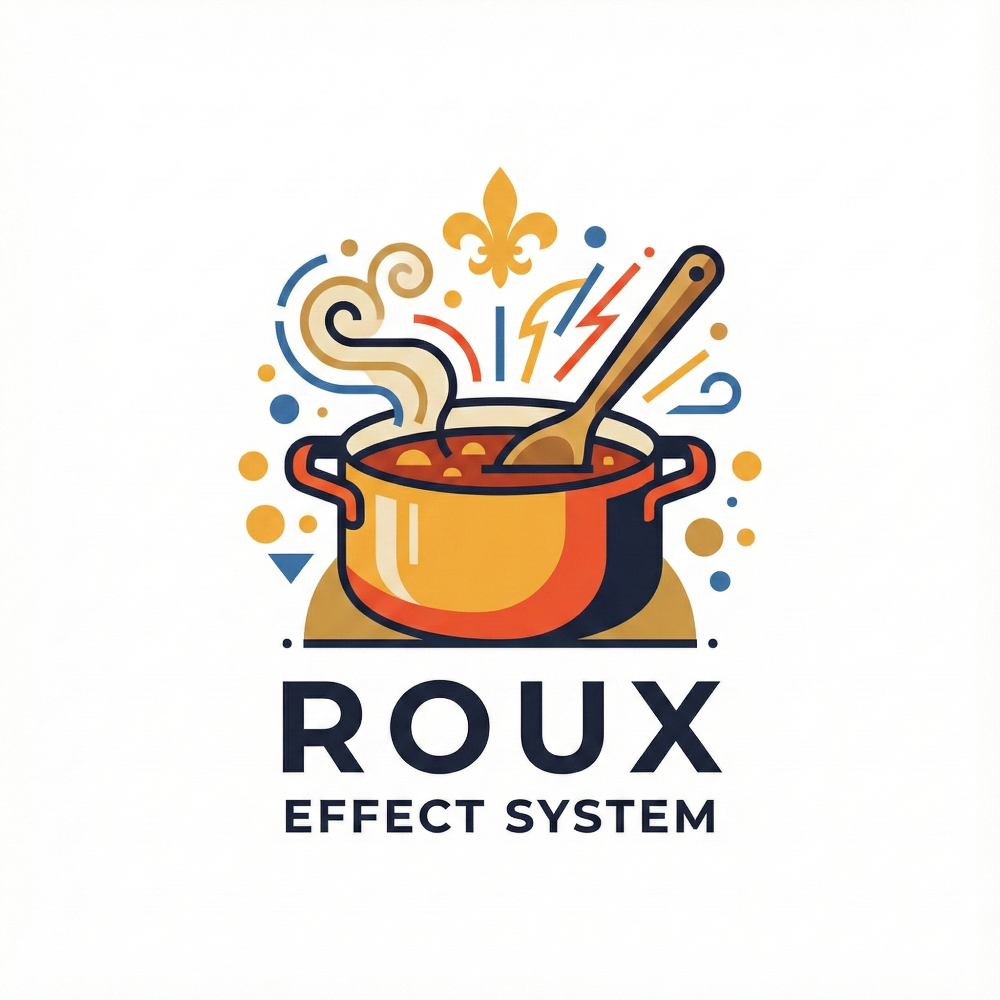

# Roux

<div align="center">
  

**A lightweight, pragmatic effect system for modern Java**

[](https://search.maven.org/artifact/com.cajunsystems/roux)
[](https://opensource.org/licenses/MIT)
</div>

---

Roux is a foundational effect system for the JVM that embraces Java's native capabilities. Built on virtual threads and structured concurrency, Roux provides a clean, composable way to handle side effects while staying close to Java's natural behavior.

## Why Roux?

- **🧵 Virtual Thread Native** - Built from the ground up for JDK 21+ virtual threads
- **🎯 Pragmatic Design** - No heavy abstractions; close to Java's natural behavior
- **🔀 Composable Effects** - Functional combinators for clean effect composition
- **⚡ Cancellation Built-in** - Interrupt-based cancellation at effect boundaries
- **🎨 Type-Safe Errors** - Explicit error channel: `Effect<E, A>`
- **🔌 Pluggable Runtime** - Swap execution strategies (virtual threads by default)
- **⚙️ Fork/Fiber Support** - Structured concurrency for parallel effect execution
- **🎭 Algebraic Effects** - Capability system for testable, composable side effects

## Installation

### Maven
```xml
<dependency>
    <groupId>com.cajunsystems</groupId>
    <artifactId>roux</artifactId>
    <version>0.2.0</version>
</dependency>
```

### Gradle (Kotlin DSL)
```kotlin
implementation("com.cajunsystems:roux:0.2.0")
```

### Gradle (Groovy)
```groovy
implementation 'com.cajunsystems:roux:0.2.0'
```

**Requirements:** Java 21 or higher

## Quick Example
```java
import com.cajunsystems.roux.*;
import java.io.IOException;
import java.nio.file.Files;
import java.nio.file.Path;

Effect<IOException, String> readFile = Effect.suspend(() -> 
    Files.readString(Path.of("config.txt"))
);

Effect<IOException, String> withFallback = readFile
    .catchAll(e -> Effect.succeed("default config"))
    .map(String::toUpperCase);

EffectRuntime runtime = DefaultEffectRuntime.create();
String result = runtime.unsafeRun(withFallback);
```

## Core Concepts

### Effects are Lazy

Effects are descriptions of computations, not computations themselves. They only execute when explicitly run.
```java
Effect<Throwable, Integer> effect = Effect.succeed(42)
    .map(x -> x * 2);  // Not executed yet!

// Execution happens here
Integer result = runtime.unsafeRun(effect);
```

### Composable Error Handling

Errors are first-class citizens in the type system.
```java
Effect<IOException, String> readConfig = Effect.suspend(() -> 
    Files.readString(Path.of("config.json"))
);

Effect<IOException, Config> parseConfig = readConfig
    .map(json -> parseJson(json))
    .catchAll(e -> Effect.succeed(Config.DEFAULT));
```

### Concurrent Effects with Fork/Fiber

Run effects concurrently and join their results.
```java
Effect<Throwable, String> fetchUser = Effect.suspend(() -> 
    httpClient.get("/users/123")
);

Effect<Throwable, String> fetchOrders = Effect.suspend(() -> 
    httpClient.get("/orders?user=123")
);

Effect<Throwable, Dashboard> dashboard = fetchUser.fork()
    .flatMap(userFiber -> fetchOrders.fork()
        .flatMap(ordersFiber -> 
            userFiber.join().flatMap(user ->
                ordersFiber.join().map(orders ->
                    new Dashboard(user, orders)
                )
            )
        )
    );
```

### Async Execution with Cancellation

Run effects asynchronously and cancel them when needed.
```java
CancellationHandle handle = runtime.runAsync(
    longRunningEffect,
    result -> System.out.println("Done: " + result),
    error -> System.err.println("Failed: " + error)
);

// Cancel from another thread
handle.cancel();  // Effect stops at next boundary
handle.await();   // Wait for completion
```

### Error Recovery and Transformation
```java
Effect<IOException, Data> loadData = Effect.suspend(() -> 
    readFromDatabase()
);

Effect<AppError, Data> transformed = loadData
    .mapError(io -> new AppError("Database error: " + io.getMessage()))
    .orElse(Effect.suspend(() -> readFromCache()));
```

### Generator-Style Effects with Capabilities

Write imperative-looking code that remains pure and testable using algebraic effects.

```java
// Define your capabilities
sealed interface LogCapability<R> extends Capability<R> {
    record Info(String message) implements LogCapability<Void> {}
}

sealed interface HttpCapability<R> extends Capability<R> {
    record Get(String url) implements HttpCapability<String> {}
}

// Use them in generator-style effects
Effect<Throwable, String> workflow = Effect.generate(ctx -> {
    ctx.perform(new LogCapability.Info("Starting workflow"));
    
    String data = ctx.perform(new HttpCapability.Get("https://api.example.com/data"));
    
    ctx.perform(new LogCapability.Info("Received: " + data));
    
    return data.toUpperCase();
}, handler);

// Swap handlers for testing - no mocking needed!
TestHandler testHandler = new TestHandler()
    .withHttpResponse("https://api.example.com/data", "test-data");

String result = runtime.unsafeRunWithHandler(workflow, testHandler);

// Or use capabilities as effects directly
Effect<Throwable, User> userEffect = new GetUser("123")
    .toEffect()  // Convert capability to effect
    .map(json -> parseJson(json, User.class))
    .retry(3)
    .timeout(Duration.ofSeconds(10));

User user = runtime.unsafeRunWithHandler(userEffect, handler);
```

**Learn more:** [Capabilities Guide](docs/CAPABILITIES.md) | [Capability Recipes](docs/CAPABILITY_RECIPES.md)

## Documentation

- **[Effect API Reference](docs/EFFECT_API.md)** - Complete API documentation with examples
- **[Structured Concurrency Guide](docs/STRUCTURED_CONCURRENCY.md)** - Scoped concurrency patterns and best practices
- **[Capabilities Guide](docs/CAPABILITIES.md)** - Algebraic effects system
- **[Capability Recipes](docs/CAPABILITY_RECIPES.md)** - Common patterns and use cases
- **[Custom Capabilities Example](examples/CustomCapabilities.md)** - Complete working example

## Key Features

### Effect Combinators

- `map` - Transform success values
- `flatMap` - Chain effects sequentially
- `catchAll` - Handle errors and recover
- `mapError` - Transform error types
- `widen` - Widen error type to `Throwable` (safe)
- `narrow` - Narrow error type to specific exception (unsafe cast)
- `orElse` - Fallback to alternative effect
- `attempt` - Convert to `Either<E, A>` for explicit handling
- `zipPar` - Run effects in parallel and combine results
- `retry(int)` / `retryWithDelay(int, Duration)` - Simple retry helpers
- `retry(RetryPolicy)` - Declarative retry with backoff, jitter, and per-error predicates
- `timeout(Duration)` - Fail with `TimeoutException` if too slow

### Structured Concurrency

- `Effect.scoped(body)` - Create a scope for structured concurrency
- `scope.fork(effect)` - Fork effect within scope with automatic cleanup
- `effect.forkIn(scope)` - Convenience method to fork in a scope
- Automatic cancellation on scope exit (success, error, or early return)
- Built on Java's `StructuredTaskScope` (JEP 453)

### Concurrency

- `fork()` - Run effect on a separate virtual thread, returns `Fiber<E, A>`
- `join()` - Wait for forked effect to complete
- `interrupt()` - Cancel a running fiber
- `zipPar(other, combiner)` - Parallel execution with result combination
- `Effects.par()` - Static helpers for 2, 3, 4 parallel effects
- Automatic cancellation at effect boundaries

### Resource Management

- `Resource.make(acquire, release)` - Safe acquire/release with guaranteed cleanup
- `Resource.fromCloseable(acquire)` - Wrap any `AutoCloseable`
- `resource.use(f)` - Acquire, use, and always release (success or failure)
- `Resource.ensuring(effect, finalizer)` - Run a finalizer after any effect (try-finally equivalent)

### Retry Policies

- `RetryPolicy.immediate()` - Retry without delay
- `RetryPolicy.fixed(Duration)` - Constant delay between retries
- `RetryPolicy.exponential(Duration)` - Doubling delay (base, base×2, base×4, …)
- `.maxAttempts(n)` - Limit total retry count
- `.maxDelay(Duration)` - Cap the computed delay
- `.withJitter(factor)` - Add ±factor randomness to avoid thundering herds
- `.retryWhen(Predicate<Throwable>)` - Only retry matching errors

### Runtime Execution

- `unsafeRun(effect)` - Synchronous execution, throws on error
- `unsafeRunWithHandler(effect, handler)` - Run with capability handler
- `runAsync(effect, onSuccess, onError)` - Asynchronous execution with callbacks
- `CancellationHandle` - Control async execution (cancel, await)

## Getting Started

### Requirements

- JDK 21 or higher (for virtual threads)
- Gradle or Maven

### Installation

**Gradle:**
```groovy
dependencies {
    implementation 'com.cajunsystems:roux:0.2.0'
}
```

**Maven:**
```xml
<dependency>
    <groupId>com.cajunsystems</groupId>
    <artifactId>roux</artifactId>
    <version>0.2.0</version>
</dependency>
```

## Examples

### Simple HTTP Client with Retry
```java
Effect<IOException, String> fetchWithRetry(String url) {
    return Effect.suspend(() -> httpClient.get(url))
        .catchAll(e -> Effect.suspend(() -> {
            Thread.sleep(1000);
            return httpClient.get(url);
        }));
}
```

### Parallel Data Fetching
```java
import static com.cajunsystems.roux.Effects.*;

// Verbose way
Effect<Throwable, Summary> fetchSummary() {
    return users.fork().flatMap(usersF ->
           orders.fork().flatMap(ordersF ->
               usersF.join().flatMap(u ->
                   ordersF.join().map(o ->
                       new Summary(u, o)
                   )
               )
           )
       );
}

// Clean way with zipPar
Effect<Throwable, Summary> fetchSummary() {
    return users.zipPar(orders, Summary::new);
}

// Or with static helper for 3+ effects
Effect<Throwable, Dashboard> fetchDashboard() {
    return par(users, orders, preferences, Dashboard::new);
}
```

### Retry with Exponential Back-off
```java
RetryPolicy policy = RetryPolicy.exponential(Duration.ofMillis(100))
    .maxAttempts(5)
    .maxDelay(Duration.ofSeconds(10))
    .withJitter(0.2)
    .retryWhen(e -> e instanceof IOException);

Effect<Throwable, String> resilient = Effect.suspend(() -> httpClient.get(url))
    .retry(policy);
```

### Resource Management (bracket / ensuring)
```java
// Guaranteed cleanup via Resource.make
Resource<Connection> connResource = Resource.make(
    Effect.suspend(() -> pool.acquire()),
    conn -> Effect.runnable(conn::close)
);

Effect<Throwable, Result> query = connResource.use(conn ->
    Effect.suspend(() -> conn.execute("SELECT ..."))
);
// Connection is always closed — success, failure, or cancellation.

// AutoCloseable shorthand
Resource<BufferedReader> readerResource = Resource.fromCloseable(
    Effect.suspend(() -> new BufferedReader(new FileReader("data.csv")))
);

// try-finally equivalent
Effect<Throwable, String> withCleanup = Resource.ensuring(
    Effect.suspend(() -> riskyOperation()),
    Effect.runnable(() -> cleanup())
);
```

### Background Task with Timeout
```java
CancellationHandle handle = runtime.runAsync(
    longTask,
    result -> System.out.println("Completed: " + result),
    error -> System.err.println("Failed: " + error)
);

// Timeout after 5 seconds
if (!handle.await(Duration.ofSeconds(5))) {
    handle.cancel();
    System.out.println("Task timed out");
}
```

## Stack Safety

Roux uses **trampolined execution** by default, providing true stack safety for arbitrarily deep effect chains. You can chain millions of `flatMap` operations without stack overflow.

## Roadmap

- [x] Core effect system with error channel
- [x] Basic combinators (map, flatMap, catchAll)
- [x] Boundary-based cancellation
- [x] Async execution with CancellationHandle
- [x] Fork/Fiber for concurrent effects
- [x] Algebraic effects via capabilities
- [x] Generator-style effect building
- [x] Scoped structured concurrency
- [x] Stack-safe trampolined execution
- [x] Race and timeout combinators
- [x] Retry policies with backoff (`RetryPolicy` — immediate, fixed, exponential, jitter, `retryWhen`)
- [x] Resource management (`Resource<A>` — make/use/fromCloseable, `Resource.ensuring`)
- [ ] Environment/Layer system for dependency injection

## Related Projects

- **[Cajun](https://github.com/CajunSystems/cajun)** - Actor framework built on Roux and modern Java 21+

## Contributing

Contributions are welcome! Please feel free to submit a Pull Request.

## License

MIT License - see [LICENSE](LICENSE) file for details

---

<div align="center">
  <sub>Built with ❤️ for the Java community</sub>
</div>